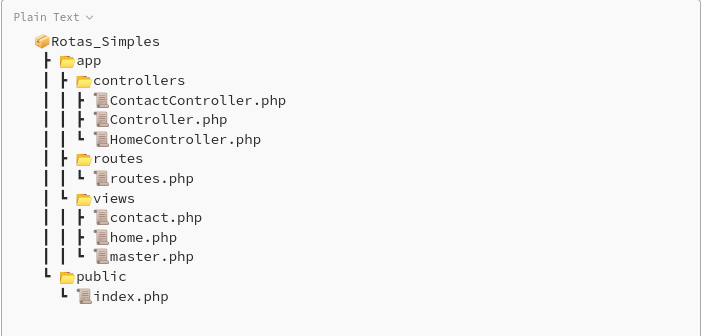

# Step by step

1. Create folder and file structure with composer and autoload.
2. Create route file with request types GET(Home,Contact) and POST(Contact).
3. Create route loading function.
4. In index.php check if the route exists according to the uri and type of request.
5. Use arrow functions for loading so you don't have to guess the route in index.php
6. Create views with plates and create standard Controllers with the view method.

# Creating folder structure

1. Inside the project folder create app and public folders.
2. Inside the public folder create the index.php file.
3. Inside the app folder create folders controllers, views, routes.
4. Inside the controllers folder create the files Controller.php, HomeController.php and ContactController.php.
5. Inside the routes folder create the routes.php file.
6. Inside the views folder create the files master.php, home.php and contact.php.

In the end, the project structure should look like this:



# Starting the composer

Run the following command:

``` bash
  composer init
```
Press **enter** for all options at the end we will have in the project the **composer.json** file and the src and vendor folders.

```JSON
  {
    "name": "zero/oop",
    "autoload": {
        "psr-4": {
            "Zero\\Rotas_Simples\\": "src/"
        }
    },
    "authors": [
        {
            "name": "Antonio Silva",
            "email": "a.silva@mailfence.com"
        }
    ],
    "require": {}
}
```

# Configuring the autoload

Change the namespace to **app\\\\** and change the **scr/** to **app/**, looking like this at the end:

```JSON
{
    "name": "zero/rotas_simples",
    "autoload": {
        "psr-4": {
            "app\\": "app/"
        }
    },
    "authors": [
        {
            "name": "Antonio Silva",
            "email": "a.silva@mailfence.com"
        }
    ],
    "require": {}
}
```

Now run composer dump autoload:

```BASH
  composer du
```

Go to index.php and require autoload.php.

```PHP
<?php
  require "../vendor/autoload.php";
```

# Creating the routes

In the routes.php file create an associative array called router with two other associative arrays being **GET** and **POST**.

```PHP
<?php
   $router = [
    'GET' => [
  
    ],
    'POST' => [

    ]  
  ];
```

Add **Home** and **Contact** controllers in GET and **Contact** in POST.

```PHP
<?php
   $router = [
    'GET' => [
      '/' => 'HomeController',
      '/contact' => 'ContactController'
    ],
    'POST' => [
      '/contact' => 'ContactController'
    ]  
  ];
```

Create the **HomeController** and **ContactController** classes respectively in the HomeController.php and ContactController.php files and give both the namespace **app\Controllers**.

```PHP
<?php

  namespace app\Controller;
  
  class HomeController{
  
  }
```

```PHP
<?php
  
  namespace app\Controller;

  class ContactController{
  
  }
```

# Loading the routes

Still in **routes.php** create the **load function** with the input parameters **controller** and **action** both **string**.

```PHP
<?php

  function load(string $controller, string $action){
  }
```

Go back to the **$router** array and inside the routes call the load function adding the action parameter, like this:

```PHP
<?php
   $router = [
    'GET' => [
      '/' => load('HomeController', 'index'),
      '/contact' => load('ContactController', 'index')
    ],
    'POST' => [
      '/contact' => load('ContactController', 'store')
    ]  
  ];
```

# Check if the controller exists

Going back to function load to implement the check if the controller exists:

```PHP
<?php

  function load(string $controller, string $action){
    
    try{
      $controllerNamespace = "app\\controllers\\{$controller}";

      if (!class_exists($controllerNamespace)) {
        throw new Exception("O controller: {$controller} não existe."); 
      }

      $controllerInstance = new $controllerNamespace();
  
    } catch(Exception $e){
      echo $e->getMessage();
    }
  }
```

1. We start a try..catch for handling errors.
2. We store the controller in the controllernamespace variable.
3. We use the class_exists() function and the not(!) operator to check if the given controller class exists.
4. If the controller exists, we instantiate a new controller.

Now we check if the action exists in the controller:

```PHP
<?php

  function load(string $controller, string $action){
    
    try{
      if (!method_exists($controllerInstance,$action)) {
        throw new Exception
        ("O método: {$action} não existe no controller: {$controller}");   
      }
      
      $controllerInstance->$action();
  
    } catch(Exception $e){
      echo $e->getMessage();
    }
  }
```

1. We use the method_exists function with the not(!) operator to find out if the action exists in the controller.
2. If the action exists, we call the action in the controller instance.

The load function at the end should look like this:

```PHP
<?php

  function load(string $controller, string $action){
    
    try{
      $controllerNamespace = "app\\controllers\\{$controller}";

      if (!class_exists($controllerNamespace)) {
        throw new Exception("O controller: {$controller} não existe."); 
      }

      $controllerInstance = new $controllerNamespace();

      if (!method_exists($controllerInstance,$action)) {
        throw new Exception
        ("O método: {$action} não existe no controller: {$controller}");   
      }
      
      $controllerInstance->$action();
  
    } catch(Exception $e){
      echo $e->getMessage();
    }
  }
```

# Creating controller methods

In HomeController(app/Controllers/HomeController.php) create index.

```PHP
<?php

  namespace app\Controller;
  
  class HomeController{
    
    public function index(){

    }

  }
```

And in ContactController(app/Controllers/ContactController.php) create index and store methods.

```PHP
<?php

  namespace app\Controller;
  
  class ContactController{
    
    public function index(){

    }

    public function store(){
    
    }

  }
```